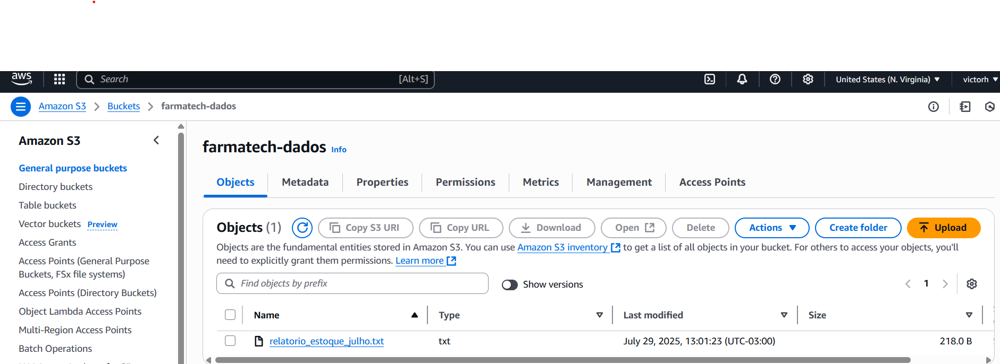

# RELATÓRIO DE IMPLEMENTAÇÃO DE SERVIÇOS AWS

**Data:** 29/07/2025  
**Empresa:** FarmaTech Soluções Farmacêuticas  
**Responsável:** Victor Hugo de Oliveira Santos

---

## Introdução

Com o crescimento da demanda por soluções digitais no setor farmacêutico, especialmente no que diz respeito ao armazenamento seguro de dados, automação de processos e conformidade com normas regulatórias, a FarmaTech Soluções Farmacêuticas iniciou um projeto de migração parcial da sua infraestrutura para a nuvem AWS (Amazon Web Services).

Este relatório descreve as etapas da implementação de três serviços fundamentais da AWS, com foco na redução de custos operacionais, aumento da eficiência interna e maior controle sobre os dados sensíveis da empresa.

---

## Descrição do Projeto

A proposta do projeto foi implementar ferramentas da AWS de forma estratégica, em três etapas principais, considerando as necessidades específicas do setor farmacêutico. O planejamento levou em conta aspectos como:

- Segurança da informação (dados de pacientes, exames e fórmulas)  
- Rastreabilidade e auditoria  
- Redução de custos com infraestrutura local  
- Automação de tarefas manuais e repetitivas  

A seguir, estão detalhadas as etapas e os serviços utilizados:

---

### Etapa 1: Armazenamento Seguro e Escalável

- **Serviço:** Amazon S3 (Simple Storage Service)  
- **Objetivo:** Substituir servidores físicos e sistemas legados por uma solução segura de armazenamento em nuvem.  
- **Aplicação na FarmaTech:**  
  Todos os documentos digitais relacionados a exames laboratoriais, fichas clínicas, controles de lotes e resultados de testes foram migrados para buckets do S3. Foram aplicadas regras de criptografia (server-side encryption), políticas de acesso por grupos e versionamento de arquivos para garantir segurança e rastreabilidade.  
  O uso do S3 permitiu não só a redução de custos com manutenção de servidores locais, mas também garantiu acesso rápido e confiável às informações, respeitando os requisitos da LGPD e diretrizes da ANVISA.

---

### Etapa 2: Automação de Tarefas Operacionais

- **Serviço:** AWS Lambda  
- **Objetivo:** Automatizar processos rotineiros sem necessidade de servidores dedicados.  
- **Aplicação na FarmaTech:**  
  Foram criadas funções Lambda para automatizar tarefas como:
  - Geração de relatórios diários de controle de estoque de medicamentos
  - Verificação da temperatura e umidade dos ambientes de armazenamento
  - Envio de notificações para farmacêuticos em caso de variação fora dos padrões  
  Com isso, a equipe reduziu o tempo gasto em atividades repetitivas e passou a focar em processos mais estratégicos. Além disso, o Lambda se mostrou ideal por ser um serviço **serverless**, ou seja, sem custo fixo — a empresa paga apenas pelas execuções.

---

### Etapa 3: Monitoramento e Alertas em Tempo Real

- **Serviço:** Amazon CloudWatch  
- **Objetivo:** Acompanhar a performance das aplicações e gerar alertas automáticos.  
- **Aplicação na FarmaTech:**  
  O CloudWatch foi configurado para monitorar métricas essenciais, como:
  - Consumo de recursos em aplicações internas  
  - Eventos de falha em processos automatizados  
  - Uso de banda em tempo real no acesso a dados críticos  
  Dashboards foram criados para visualização rápida por parte da equipe de TI e alarmes foram configurados para notificar responsáveis sempre que um limite aceitável fosse ultrapassado. Isso permitiu maior controle dos sistemas e preveniu falhas em operações sensíveis, como o rastreamento de lotes e auditorias.

---

## Conclusão

A adoção dos serviços da AWS pela FarmaTech resultou em melhorias significativas nos processos internos, destacando-se:

- Redução de custos operacionais com infraestrutura local  
- Maior eficiência das equipes por meio da automação  
- Aumento da segurança e conformidade com normas regulatórias  
- Visibilidade em tempo real dos recursos utilizados

A transição para a nuvem foi estratégica e executada em etapas, respeitando o ritmo e a estrutura da empresa. Com base nos resultados obtidos, recomenda-se a continuidade do uso das ferramentas AWS e a expansão para novos serviços, como Amazon RDS (para banco de dados relacional) e AWS Backup (para estratégias de recuperação).

---

## Anexos

- Print dos buckets S3 configurados com versionamento  
- Exemplo de função Lambda automatizada  
- Dashboard de monitoramento do CloudWatch  
- Referências técnicas da AWS utilizadas  
- [Link para documentação da ANVISA – Segurança e Rastreabilidade de Dados](https://www.gov.br/anvisa/)

---

**Assinatura do Responsável pelo Projeto:**  
Victor Hugo de Oliveira Santos

---

## 📷 Imagem da Etapa 1 – Amazon S3

### Bucket com arquivo de relatório:


---

## ⚙️ Etapa 2 – AWS Lambda: Função em Java

Para este projeto, simulamos a criação de uma função Lambda escrita em Java, utilizando a interface `RequestHandler`, que gera um relatório fictício de estoque.

```java
// Exemplo da função Lambda em Java
public class GerarRelatorioEstoque implements RequestHandler<Object, Map<String, Object>> {
    public Map<String, Object> handleRequest(Object input, Context context) {
        Map<String, Object> relatorio = new HashMap<>();
        relatorio.put("produto", "Paracetamol 500mg");
        relatorio.put("quantidade", 2500);
        relatorio.put("validade", "12/2026");
        // ...
        return relatorio;
    }
}

